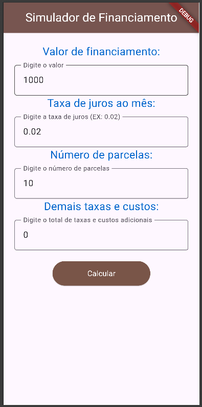
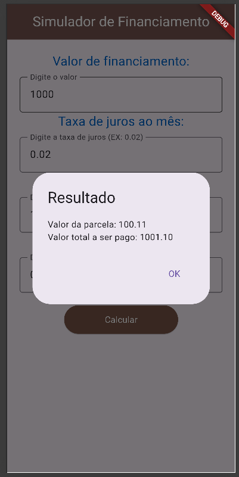

#  Simulador de Financiamento - bitola2026
Aplicativo desenvolvido em Flutter para simular financiamentos de forma simples e prática.

##  Funcionalidades
- Inserir valor do financiamento  
- Definir taxa de juros mensal (ex: 0.02)  
- Escolher número de parcelas  
- Adicionar taxas e custos extras  
- Calcular:  
  - Valor da parcela  
  - Valor total a ser pago  

##  Telas do App

### Tela 1
Tela inicial com campos vazios para preenchimento dos dados do financiamento.

### Tela 2
Tela com os campos preenchidos (valor, taxa de juros, número de parcelas e custos adicionais).

### Tela 3
Tela de resultado exibida em um pop-up com o valor da parcela e o total a ser pago.

##  Tecnologias utilizadas
- Flutter  
- Dart  

##  Estrutura de imagens
assets/img/

##  Como executar
flutter pub get  
flutter run