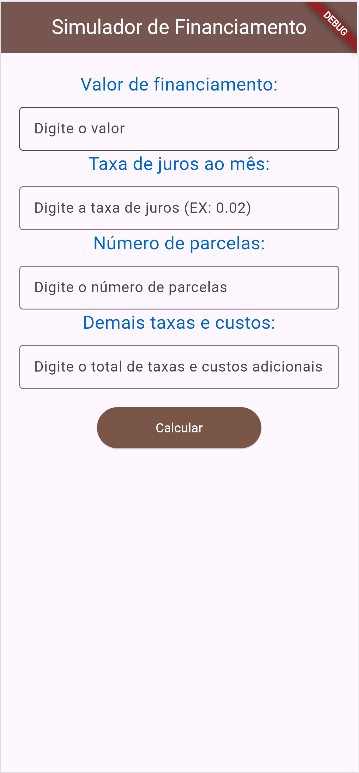

# 📱 Simulador de Financiamento - bitola2026

Aplicativo desenvolvido em Flutter para simular financiamentos de forma simples e prática.

## 🚀 Funcionalidades

- Inserir valor do financiamento  
- Definir taxa de juros mensal  
- Escolher número de parcelas  
- Adicionar taxas e custos extras  
- Calcular:
  - Valor da parcela  
  - Valor total a pagar  

## 🖼️ Telas do App

### Tela 1

### Tela 2

### Tela 3

## 🛠️ Tecnologias utilizadas

- Flutter  
- Dart  

## 📂 Estrutura de imagens

assets/img/

## ▶️ Como executar

flutter pub get  
flutter run