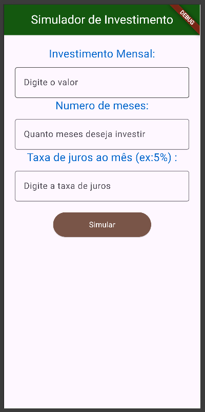
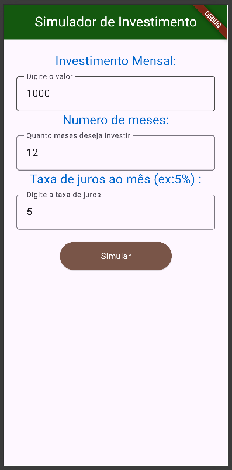
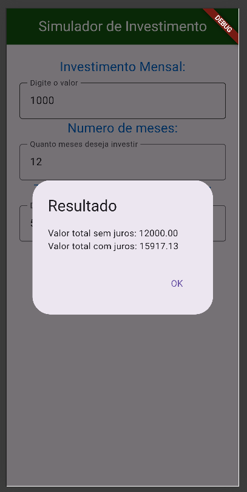

# calculadora_bitola2026

## Sobre o projeto
A Calculadora de Bitola é um aplicativo desenvolvido para auxiliar no dimensionamento de cabos elétricos em instalações residenciais.

A proposta é permitir que o usuário informe a distância do circuito e a corrente elétrica, e o sistema calcule automaticamente a bitola recomendada do cabo.

O usuário informa:

Distância em metros  
Corrente elétrica (em amperes)  

E o sistema retorna:

Bitola recomendada para 12V  
Bitola recomendada para 220V  

## Prints das telas

### Tela 1

### Tela 2

### Tela 3

## Funcionalidades
- Cálculo da bitola de cabos elétricos  
- Suporte para diferentes tensões (12V e 220V)  
- Interface simples e intuitiva  
- Entrada de dados rápida e prática  

##  Tecnologias utilizadas
Flutter  
Dart  

## Como executar o projeto
git clone https://github.com/seu-usuario/calculadora_bitola2026.git  
terminal do vscode  

flutter pub get  
flutter run  

## Estrutura do projeto
CalculadoraBitola/
├── assets/  
│   └── img/  
│       ├── tela1.png  
│       ├── tela2.png  
│       └── tela3.png  
├── lib/  
│   └── main.dart  
├── pubspec.yaml  
└── README.md  

## Aprendizados
- Cálculo aplicado à elétrica residencial  
- Manipulação de inputs no Flutter  
- Exibição de resultados em pop-up  
- Estruturação de aplicativos  

## Autor(a)
- Clara Andrzejewsky Antonacci