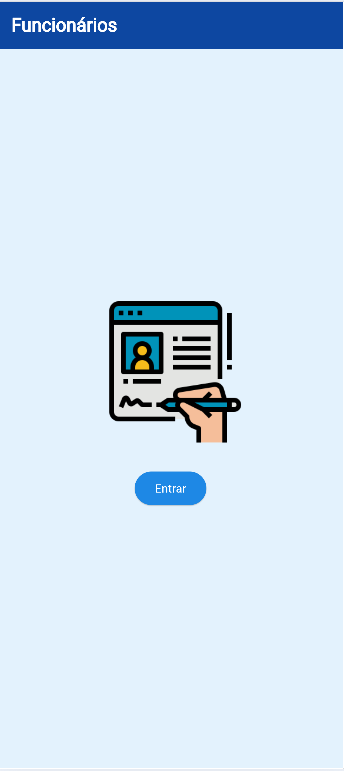
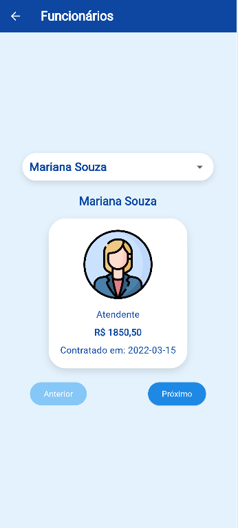
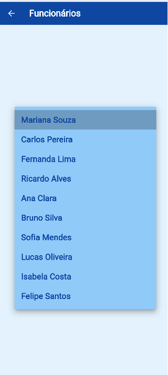

# Funcionários
Exemplo de um app flutter que **abre dados Mockup** JSON, uma lista de funcionários. Exemplo de arquivos de estilização com paleta de cores e tema.

## Tecnologias
- Flutter
- VsCode
- Android Studio

|Efeitos|WidGets|
|-|:-:|
|Tema|ThemeData.light().copyWith()|
|Imagens|Image.asset()|
|Assincronicidade|async|
|Carregar arquivos texto locais|rootBundle.loadString('assets/...');|
|Conversão de dados|json.decode()|
|Menu dropDown "Select"|DropdownButton<dynamic>()|
|Botões de controle de conteúdos em tela|ElevatedButton()|
|Avatar|CircleAvatar()|
|Animação Splash|AnimationController + ScaleTransition|

||||
|:-:|:-:|:-:|
|Splash|Home|Menu|

# Para testar
- 1 Clone o repositório
- 2 Abra com VsCode, Abra o terminal **CTRL + "**, execute o comando `flutter pub get` para instalar as dependências
- 3 Navegue até o arquivo lib/main.dart e dê **play** ou execute o comando `flutter run` para rodar o projeto
- 4 Escolha navegador ou um emulador para testar
- O projeto irá abrir a tela de Splash com uma animação e ao clicar em **Entrar** irá acessar a tela principal
